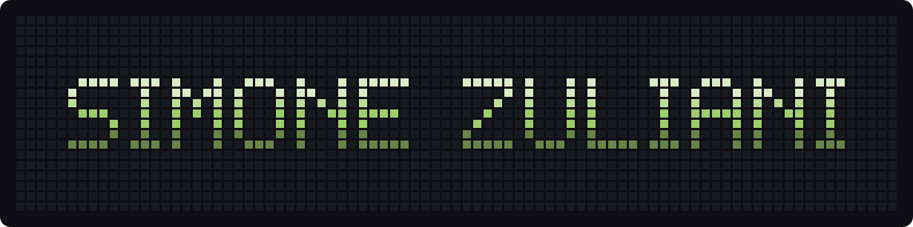

<div align="center">

<a href="https://aiazzone.github.io"></a>

<br><br>

**Chartered electrical engineer who writes desktop software.**<br>
Python and Qt, from the timeline of a video editor to the millisecond a machine has to be told where to reach.

<br>

[](https://aiazzone.github.io)
[](mailto:simone.engineer@gmail.com)
[](https://www.linkedin.com/in/simonezuliani/)

</div>

<br>


## `~/about`

I started in power — substations, transmission lines, photovoltaic plants — and ended
up writing Python, because the interesting problem stopped being the cable sizing and
became **what the machine knows about the thing in front of it**.

Most of what I build is a desktop application with something demanding on the other
end: a camera at thirty frames a second, a GPU running inference, a PLC that has to
receive a coordinate while it is still true. The engineering is rarely the algorithm.
It is keeping the UI thread off the critical path, discarding what is already stale,
and making sure the program never slows down *in silence*.

I still draw schematics. The two halves talk to each other more than people expect.

<br>


## `~/projects`

### [IVE — Individual Video Editor](https://github.com/Aiazzone/IVE-Individual-video-editor)


A free, open-source video editor built around a CapCut-style timeline. Two ideas hold
it together.

Every creative asset — colour looks, transitions, export presets, sticker packs — is a
**declarative JSON file** you can copy into a folder and send to a friend. Nothing
executes, so installing content is safe, and nothing sits behind an account.

And every feature of the program is exposed as a typed **Action**, invoked identically
from the interface, from a script, or from an assistant. There is nothing reachable
only by clicking.

- Frame-accurate playback, audio clock driving A/V sync
- Multi-clip timeline — trimming, snapping, real waveforms
- 29 colour looks with live previews on your own footage
- 16 transitions; a wipe is just a greyscale luma map
- Lottie and SVG stickers, composited identically on export
- Titles typed live onto the frame, moved with on-video handles
- Music beds with ducking under speech
- Social export presets — the preview graph renders the file

```
Python  ████████████████████████████████   64.4 %
QML     █████████████████                  35.4 %
GLSL    ▏                                   0.2 %
```

PySide6 / Qt Quick on the surface, FFmpeg through PyAV underneath, an engine modelled
on MLT. Still early: it opens, edits, plays and exports, and it breaks between commits.

<br>


## `~/stack`

**Applications**


**Media &amp; vision**


**Industrial I/O**


**Electrical design**


<br>


## `~/background`

| | |
|---|---|
| `2014 —` | Senior electrical designer &amp; software developer — beverage-industry machinery |
| `2012 – 2014` | Electrical engineer, high-voltage substations |
| `2010 – 2012` | Design engineer, photovoltaic plants &amp; building systems |
| `2009 – 2010` | Research internship — magnetic-field assessment algorithm for city substations |
| `2011` | Chartered engineer — Ordine degli Ingegneri |
| `2007 – 2010` | MSc Electrical Engineering — Università degli Studi di Padova |
| `2003 – 2007` | BSc Energy Engineering — Università degli Studi di Padova |
| `1998 – 2003` | Perito elettrico — I.T.I.S. G. Ferraris |

<br>

<div align="center">

<br><br>
<sub>Italian &amp; Portuguese (native) · English · Spanish &nbsp;•&nbsp; NR-10 certified</sub>
</div>
